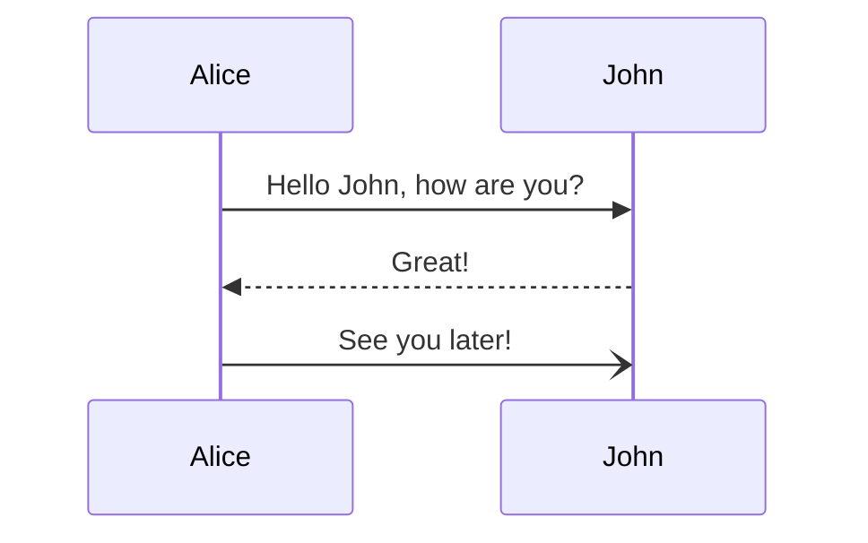
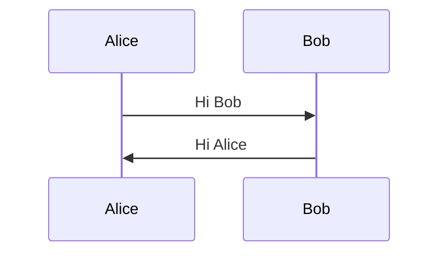
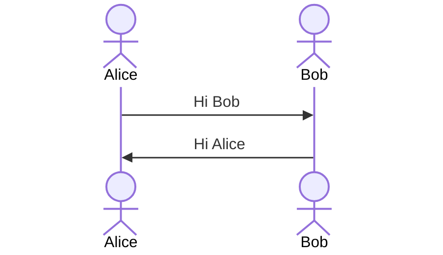
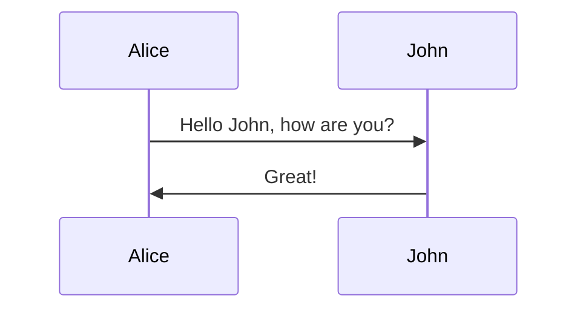
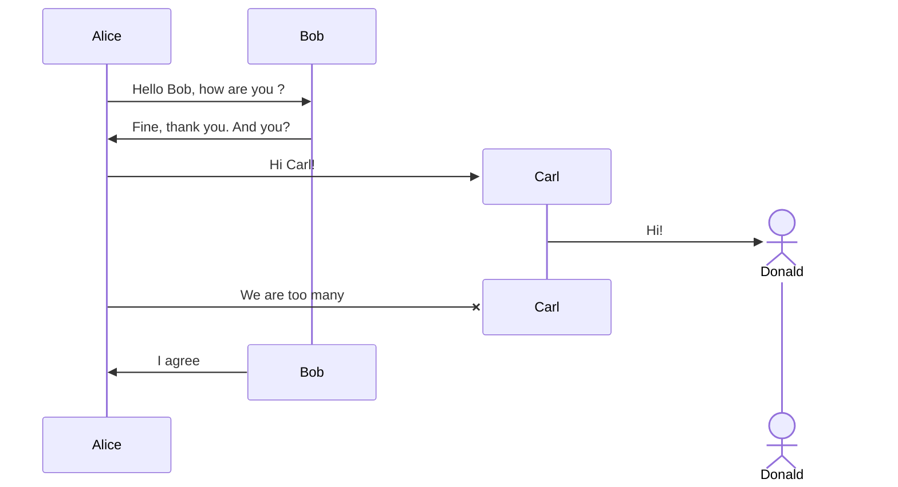
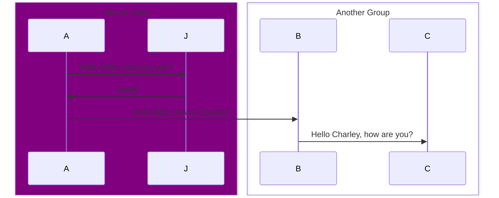

Your task is to build a mermaidJS diagram to help users visualize an answer provided to question they did. You'll be provided the "Question", the "Answer", the "DiagramType" and the "DiagramTypeDocs"
Your output will be parsed and validate so you must reply with VALID mermaidJS code only and in the following format:
```mermaid
{ diagram }
```

Prefer diagrams with simple syntax
Avoid styling on the diagram
Escape characters when needed
Make sure that you don't use any forbidden mermaid characters
Make sure to below the instructions and examples in the syntax documentation
You MUST produce valid mermaidJS syntax!

# Question - Question from the user
How do you authenticate with bearer token?

# Answer - Answer given to the user

To authenticate with a bearer token when using the FortiGate API, you follow a specific process that involves modifying the request headers to include the token. The codebase provides a method specifically for handling bearer token authentication, which is part of the login process in the [`FortiGateBase`](fortigate_api/fortigate_base.py#L133-L175) class.

Here's an outline of the steps involved in bearer token authentication:

1. Create a new session using the `requests.session()` method.
2. Construct the URL for a test endpoint to validate the token, such as `/api/v2/cmdb/system/status`.
3. Add the `Authorization: Bearer <token>` header to the request. This is done using the [`_bearer_token`](fortigate_api/fortigate_base.py#L198-L200) method, which constructs the header by appending the token to the `Bearer` prefix.
4. Send a GET request to the test endpoint with the header included.
5. Check the response to ensure the authentication was successful. If the request fails, it raises an exception.

Below is a simplified version of the code that demonstrates how bearer token authentication is implemented:

```type:Quoted,lang:Python,path:fortigate_api/fortigate_base.py,lines:144-155
# token
if self.token:
    try:
        response: Response = session.get(
            url=f"{self.url}/api/v2/cmdb/system/status",
            headers=self._bearer_token(),
            verify=self.verify,
        )
    except Exception as ex:
        raise self._hide_secret_ex(ex)
    response.raise_for_status()
    self._session = session
    return
```


This code snippet is part of the [`login`](fortigate_api/fortigate_base.py#L133-L175) method. It shows how to authenticate using a bearer token by sending a request to the FortiGate API with the token included in the headers.

# DiagramType - Diagram type that you must use and why it was chosen
Diagram Type: sequenceDiagram
Reasoning: The process described involves a sequence of actions and interactions between the user, the code (or system), and the API endpoint. A sequence diagram is ideal for illustrating this order of operations and the flow of messages (requests and responses) between the entities involved. Specifically, it can depict the method calls, the preparation of the request with the bearer token, the submission of the request to the API, and finally, the handling of the API's response. This makes the sequence diagram the most suitable choice for visualizing the authentication process with a bearer token.

# DiagramTypeDocs - Syntax documentation to build the diagram

> A Sequence diagram is an interaction diagram that shows how processes operate with one another and in what order.

Mermaid can render sequence diagrams.



```note
A note on nodes, the word "end" could potentially break the diagram, due to the way that the mermaid language is scripted.

If unavoidable, one must use parentheses(), quotation marks "", or brackets {},[], to enclose the word "end". i.e : (end), [end], {end}.
```

## Syntax

### Participants

The participants can be defined implicitly as in the first example on this page. The participants or actors are
rendered in order of appearance in the diagram source text. Sometimes you might want to show the participants in a
different order than how they appear in the first message. It is possible to specify the actor's order of
appearance by doing the following:



### Actors

If you specifically want to use the actor symbol instead of a rectangle with text you can do so by using actor statements as per below.



### Aliases

The actor can have a convenient identifier and a descriptive label.



### Actor Creation and Destruction (v10.3.0+)

It is possible to create and destroy actors by messages. To do so, add a create or destroy directive before the message.

```
create participant B
A --> B: Hello
```

Create directives support actor/participant distinction and aliases. The sender or the recipient of a message can be destroyed but only the recipient can be created.



#### Unfixable actor/participant creation/deletion error

If an error of the following type occurs when creating or deleting an actor/participant:

> The destroyed participant **participant-name** does not have an associated destroying message after its declaration. Please check the sequence diagram.

And fixing diagram code does not get rid of this error and rendering of all other diagrams results in the same error, then you need to update the mermaid version to (v10.7.0+).

### Grouping / Box

The actor(s) can be grouped in vertical boxes. You can define a color (if not, it will be transparent) and/or a descriptive label using the following notation:

```
box Aqua Group Description
... actors ...
end
box Group without description
... actors ...
end
box rgb(33,66,99)
... actors ...
end
```

```note
If your group name is a color you can force the color to be transparent:
```

```
box transparent Aqua
... actors ...
end
```




# Your output