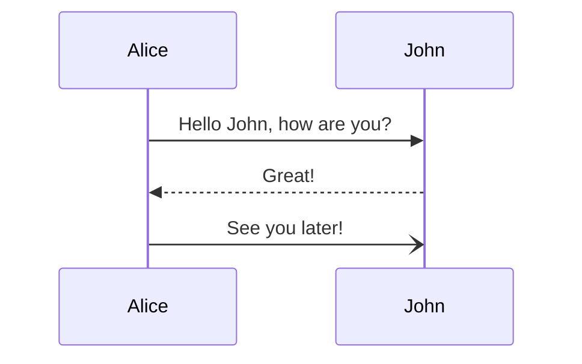
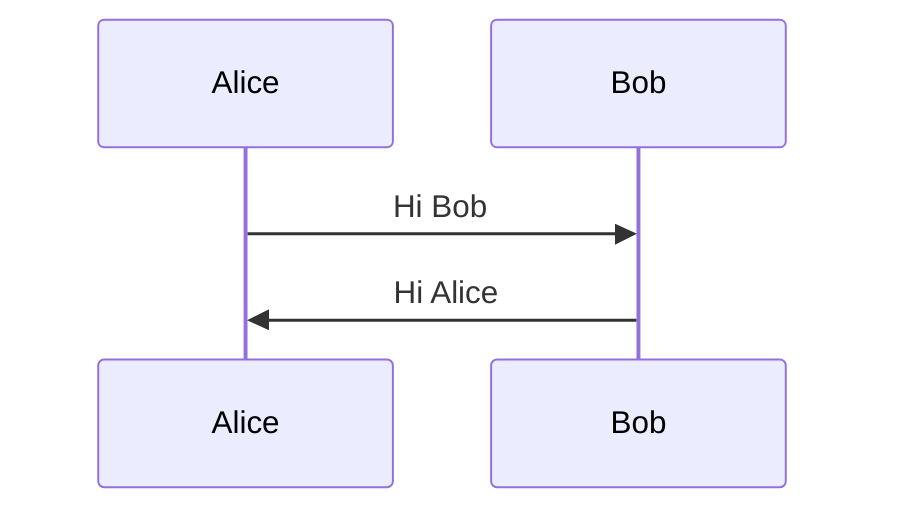
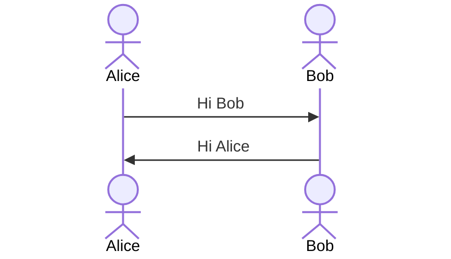
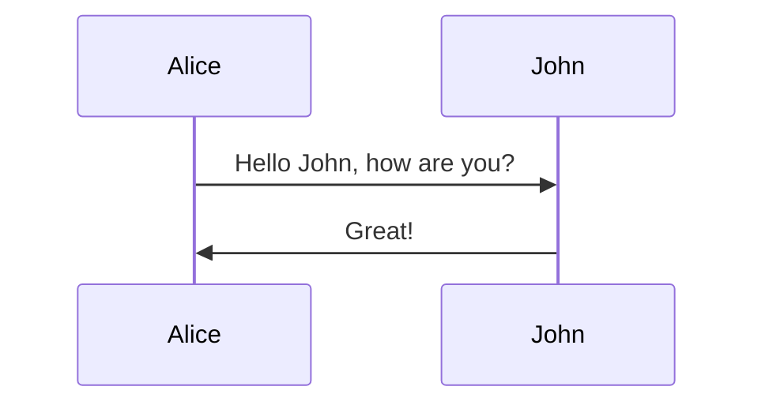
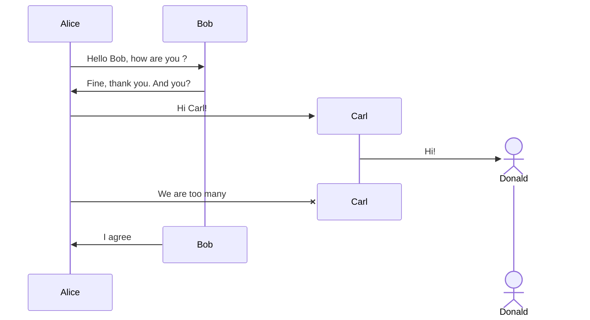
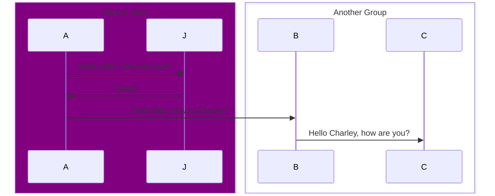

Your task is to build a mermaidJS diagram to help users visualize an answer provided to question they did. You'll be provided the "Question", the "Answer", the "DiagramType" and the "DiagramTypeDocs"
Your output will be parsed and validate so you must reply with VALID mermaidJS code only and in the following format:
```mermaid
{ diagram }
```

It is vital that your produce valid syntax for the mermaidJS so it's preferable to create diagrams using simple syntax.
Take into account when you need to escape characters for the syntax to be valid

# Question - Question from the user
проверь код на ошыбки

# Answer - Answer given to the user
### Проверка кода на ошибки:

1. **Syntax Error Handling:**
   - The code snippet provided seems to be a JavaScript code for handling user interactions on a web page.
   - It is structured with event listeners and functions to manage login, orders, search, ratings, feedback, sorting, cart management, payment, and form interactions.
   - The code appears to be well-segmented and follows a logical flow for different functionalities.
   - No syntax errors are evident in the provided code snippet.

2. **Exception Handling:**
   - The code includes event listeners with functions that handle form submissions, user interactions, and updates to the displayed information.
   - The code seems to handle different scenarios such as successful login, order creation, search functionality, rating updates, feedback submission, sorting orders, cart management, and payment processing.
   - Exception handling is not explicitly implemented in the provided code snippet, but the code seems to follow a structured approach to manage different user interactions.

3. **Error Handling:**
   - The code snippet does not contain explicit error handling mechanisms such as try-except blocks for catching exceptions.
   - Error messages are displayed using JavaScript's `alert()` function in case of incorrect user input or insufficient funds for payment.
   - The code focuses on managing user interactions and updating the displayed content based on user actions.

Overall, the code snippet appears to be well-structured for handling various user interactions on a web page. It covers functionalities like login, order management, search, ratings, feedback, cart operations, and payment processing without explicit error handling mechanisms like try-except blocks.

# DiagramType - Diagram type that you must use and why it was chosen
Diagram Type: sequenceDiagram
Reasoning: Given the description emphasizes interactions between processes or operations (like event listeners handling various user actions such as login, orders, search, etc.), a sequence diagram seems most appropriate. It can illustrate the sequence of these actions and their responses over time, making it easier to understand the flow of the described functionalities. Sequence diagrams are specifically designed to show how different parts of a system interact with each other in a specific order, which aligns with the task of reviewing code functionalities that handle user interactions and updates on a webpage.

# DiagramTypeDocs - Syntax documentation to build the diagram

> A Sequence diagram is an interaction diagram that shows how processes operate with one another and in what order.

Mermaid can render sequence diagrams.



```note
A note on nodes, the word "end" could potentially break the diagram, due to the way that the mermaid language is scripted.

If unavoidable, one must use parentheses(), quotation marks "", or brackets {},[], to enclose the word "end". i.e : (end), [end], {end}.
```

## Syntax

### Participants

The participants can be defined implicitly as in the first example on this page. The participants or actors are
rendered in order of appearance in the diagram source text. Sometimes you might want to show the participants in a
different order than how they appear in the first message. It is possible to specify the actor's order of
appearance by doing the following:



### Actors

If you specifically want to use the actor symbol instead of a rectangle with text you can do so by using actor statements as per below.



### Aliases

The actor can have a convenient identifier and a descriptive label.



### Actor Creation and Destruction (v10.3.0+)

It is possible to create and destroy actors by messages. To do so, add a create or destroy directive before the message.

```
create participant B
A --> B: Hello
```

Create directives support actor/participant distinction and aliases. The sender or the recipient of a message can be destroyed but only the recipient can be created.



#### Unfixable actor/participant creation/deletion error

If an error of the following type occurs when creating or deleting an actor/participant:

> The destroyed participant **participant-name** does not have an associated destroying message after its declaration. Please check the sequence diagram.

And fixing diagram code does not get rid of this error and rendering of all other diagrams results in the same error, then you need to update the mermaid version to (v10.7.0+).

### Grouping / Box

The actor(s) can be grouped in vertical boxes. You can define a color (if not, it will be transparent) and/or a descriptive label using the following notation:

```
box Aqua Group Description
... actors ...
end
box Group without description
... actors ...
end
box rgb(33,66,99)
... actors ...
end
```

```note
If your group name is a color you can force the color to be transparent:
```

```
box transparent Aqua
... actors ...
end
```




# Your output